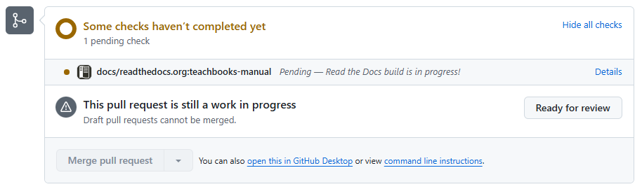

# Build pull requests

```{admonition} User types
:class: tip
This section is useful for user type 3-5.
```

When using the [deploy-book-workflow](../external/deploy-book-workflow/README.md) you're not able to build pull requests. When you'd like to contribute to the book of someone else with a fork, this requires you to set up the deploy-book-workflow in your fork to be able to show the proposed changes in the book. Furthermore, when proposing your contribution in a pull-request, you'd have to manually refer to your own built book. This process can be made easier by using [Read the Docs](https://about.readthedocs.com/?ref=readthedocs.org) for building the books with changes of a pull request.

Read the docs is not recommended for final versions of your book because of the advertisement in the free version.

This workflow does not work if you have local sphinx extensions in your book (extensions in `book/_ext` like [](./apa.md)).

## Setting up building of pull-requests

### Add configuration file to your repository

Add a file `.readthedocs.yaml` to the root of your repository, containing the following content:

```yaml
version: 2

build:
  os: ubuntu-24.04
  tools:
    python: "3.13"
  jobs:
    pre_build:
      - "sed -i '/local_extensions:/,/^[^ ]/d' book/_config.yml"
      - "jupyter-book config sphinx book/"

python:
  install:
    - requirements: requirements.txt
    - requirements: standard-imghdr

sphinx:
  builder: html
  fail_on_warning: true
  configuration: book/conf.py
```

### Setup Read The Docs account

Setup an account at [](https://app.readthedocs.org/accounts/login/?next=/dashboard/). We recommend using your GitHub account for authentication.

When authorizing Read the Docs for your GitHub account, you can grant access by Read the Docs for organization you own too. Do this if your book is part of an organization.

### Authorize access to organization
When you didn't do so in the previous step, or you'd like to grant access at a later moment, you can grant/revoke access by Read the Docs to organization your own [`personal GitHub Settings - Integrations - Applications - Authorized OAuth Apps - Read the Docs Community`](https://github.com/settings/connections/applications/fae83c942bc1d89609e2).

### Add project in Read The Docs

On your [dashboard](https://app.readthedocs.org/dashboard/), add a new project. Find your GitHub repository (you might need to refresh your repositories if you've recently updated authorizations)

### Enable Pull Request build

In the setting of your newest project, enable build of pull request by selecting the option in `Building - Pull request builds - Build pull requests for this project`.

## Usage

When opening a pull request, GitHub will shows this line:



Click 'Details' to see the logs of the build process.

Whenever the build is done, c